# BSidesDFW 2023 Badge Assembly

This badge kit is an entry level learn to solder kit that only contains five components.

What follows is a detailed step by step assembly guide.

## Gather PCB and Components

Take out the PCB and component bag and get all the components ready for assembly.

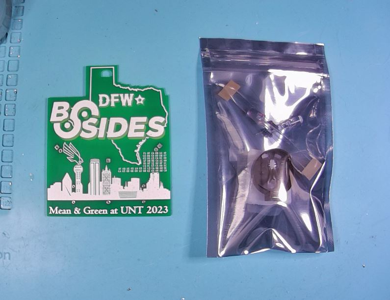
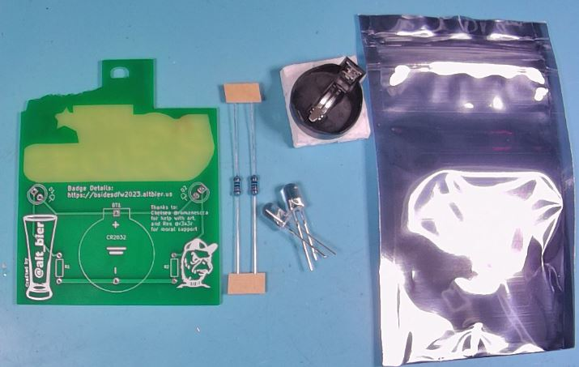

## Place and Solder Resistors

Take the two resistors and place them into the labeled holes in the PCB.

The resistors can be placed in either direction.

The body of the resistor should be on the back side of the PCB and the legs on the front side of the PCB should be bend at a 45 degree angle to hold the resistor in place.

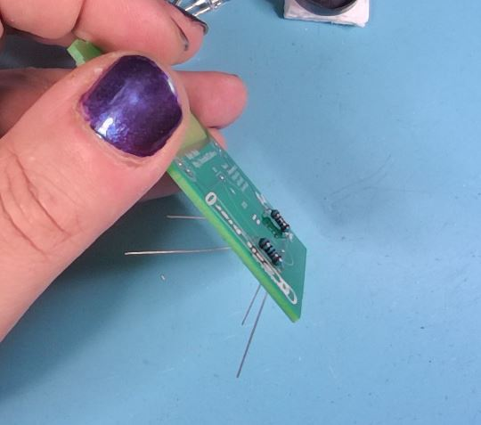

Use a soldering iron to solder the resistors on the front side of the PCB.

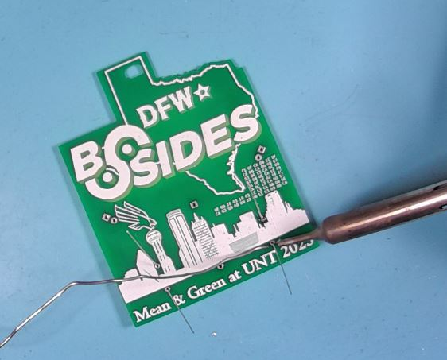

Verify your solder joint look good.  The solder should cover the whole pad on the PCB and travel slightly up the leg and should be shiny in color.  It should look like a small shiny volcano.

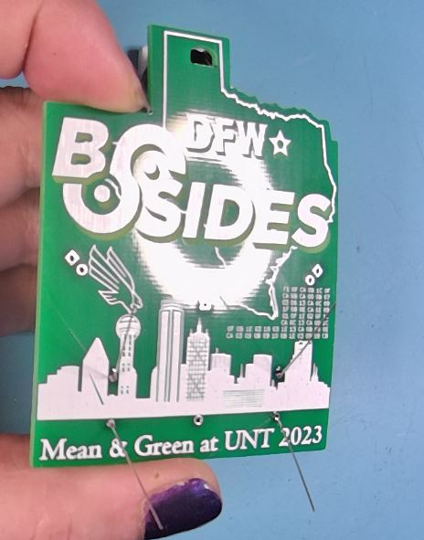

Use a diagonal cutter to trim the legs on the front of the PCB.  Be careful not to cut into the solder joint.

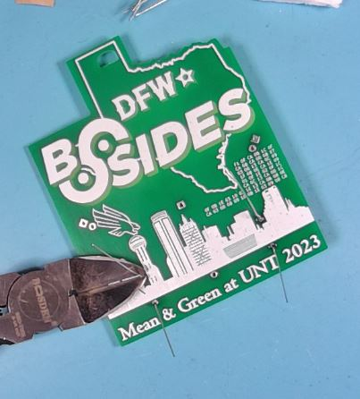

Check the solder joints after trimming and if needed rapair solder joints by resoldering.

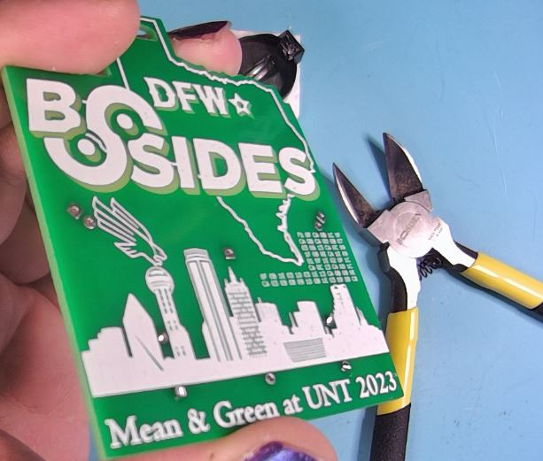

## Place and Solder LEDs

Take the two LEDs and place them into the labeled holes in the PCB.

The LEDs are directional and must be placed in the proper holes to maintain thier direction.

Each LED will have a long leg which will be placed in the hole with a round pad towards the inside of the PCB and a short leg which will be placed in the hold with a square pad towards the outside of the PCB.

Only insert the LED legs about one third of the way down and then bend the LED over so that the body of the LED is pressed against the PCB in the solder mask void area (the area without green color).

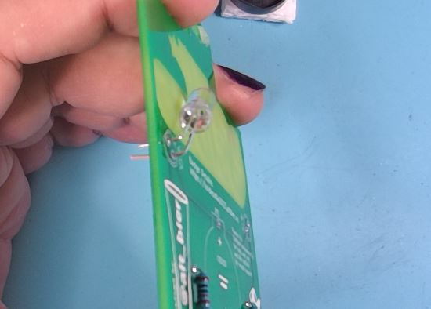
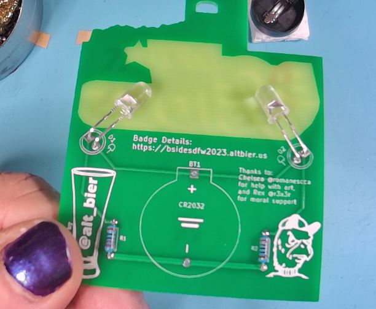
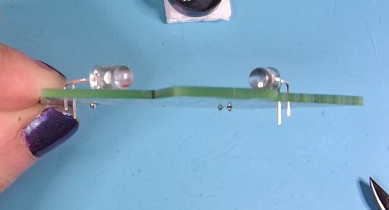

Use a soldering iron to solder the LEDs on the front side of the PCB.  You can use the small piece of foam from the battery connector to help keep the PCB level while soldering.

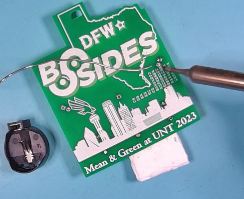

Verify your solder joint look good.  The solder should cover the whole pad on the PCB and travel slightly up the leg and should be shiny in color.  It should look like a small shiny volcano.

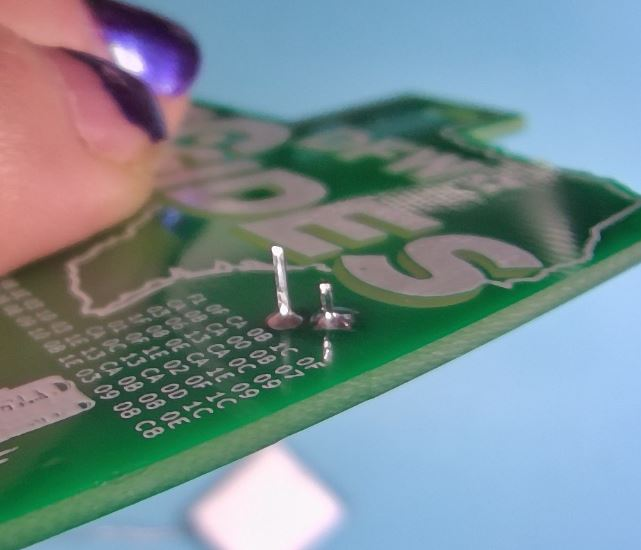

Use a diagonal cutter to trim the legs on the front of the PCB.  Be careful not to cut into the solder joint.

Check the solder joints after trimming and if needed rapair solder joints by resoldering.

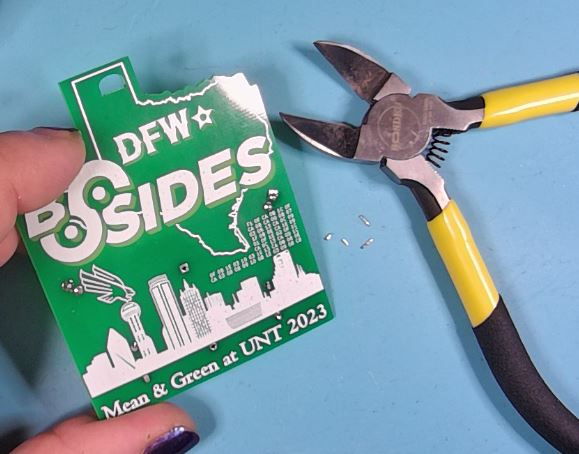

Check that the LEDs are bent properly to be positioned against the PCB in the solder mask void area.  Use pliers as needeed to gently move the LEDs.

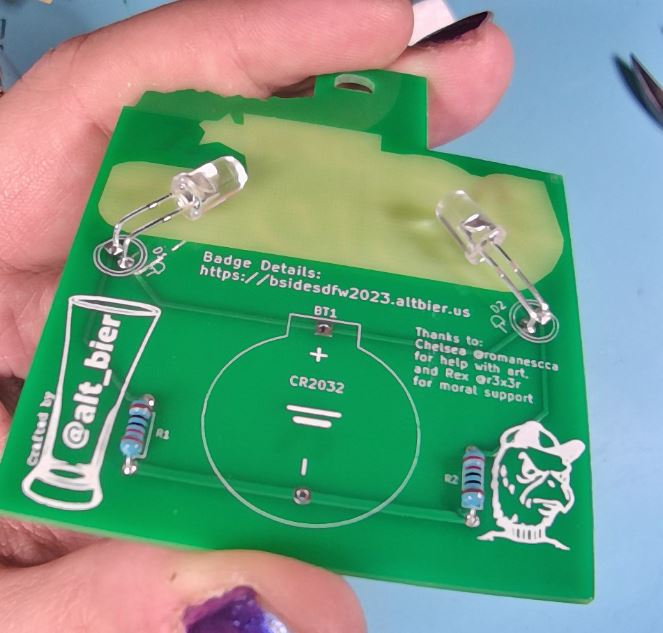

## Place and Solder Battery Connector

Take the Battery Connector and place it into the labeled holes in the PCB.

The Battery Connector is directional and must be placed in the proper holes to maintain its direction.

An outline of the Battery Connector is printed on the PCB to assist with proper placement.

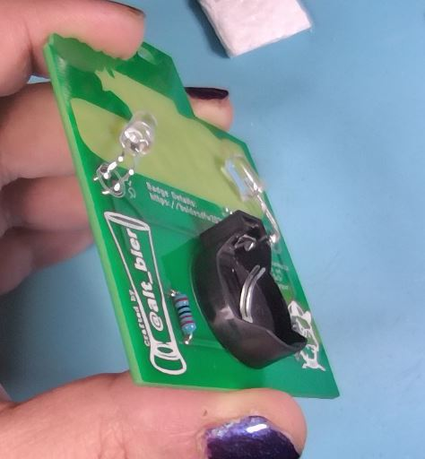

Use a soldering iron to solder the Battery Connector on the front side of the PCB.

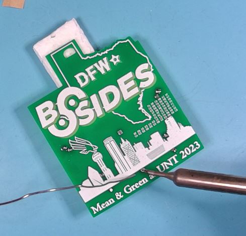

Verify your solder joint look good.  The solder should cover the whole pad on the PCB and travel slightly up the leg and should be shiny in color.  It should look like a small shiny volcano.

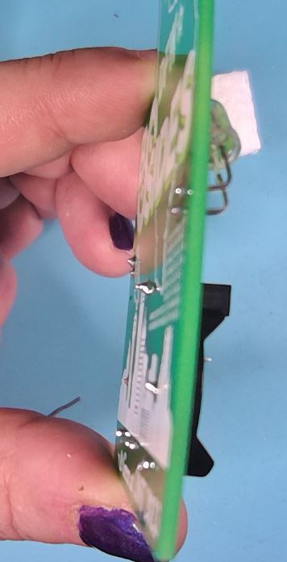

The Battery Connector legs are short enough that they should not require trimming.

## Insert Battery and Test

Take the Battery from its package and place it into the battery connector on the badge.

Note that the battery should be inserted with its positive + side facing out.

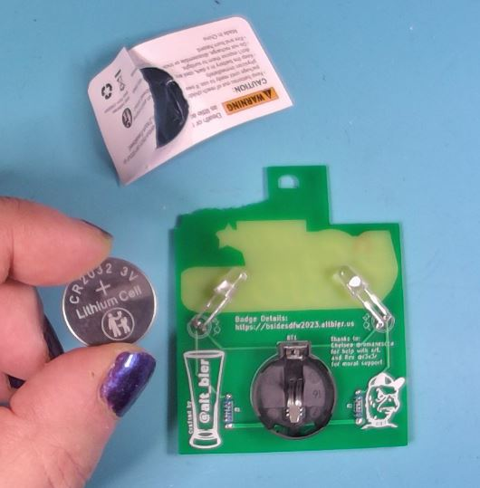

If both LEDs light up then this is a good test.  If not you will need to remove the battery and check your work making repairs as needed.

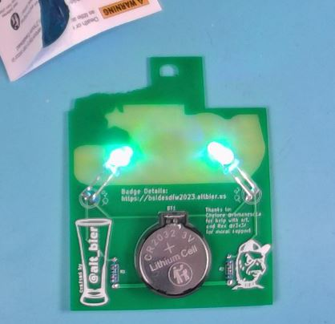

## Attach Lanyard and Enjoy!

The lanyard provided in the kit is a J-clip type and should easily clip into the hole at the top of the badge.

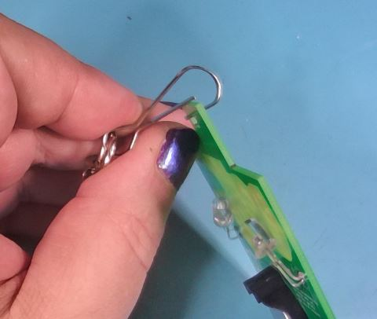

Wear and Enjoy!

