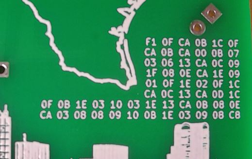

# Crytpo Challenge Solution

This page will provide the SOLUTION to the Crytpo Challenge on the badge.



# SPOILER ALERT

There are no hints here to help your progression.

This page will SHOW YOU THE SOLUTION.

If you want to solve the challenge on your own then READ NO FURTHER and CLOSE THIS PAGE NOW

SPOILER ALERT

If you want to solve the challenge on your own READ NO FURTHER

CLOSE THIS PAGE NOW or you will be SPOILED by the SOLUTION

SPOILER ALERT

If you want to solve the challenge on your own READ NO FURTHER

CLOSE THIS PAGE NOW or you will be SPOILED by the SOLUTION

SPOILER ALERT

If you want to solve the challenge on your own READ NO FURTHER

CLOSE THIS PAGE NOW or you will be SPOILED by the SOLUTION

SPOILER ALERT

If you want to solve the challenge on your own READ NO FURTHER

CLOSE THIS PAGE NOW or you will be SPOILED by the SOLUTION

---

# Solving the Crypto Challenge

This is a fairly simple challenge designed to make people think about the steps involved in working with hidden codes.

It utilizes character substitution with simple cryptography and includes visible hints.

## Cryptogram

The first thing you will notice about this challenge is that the cryptogram is presented in HEX.

```
                  F1 0F CA 0B 1C 0F
                  CA 0B CA 00 0B 07
                  03 06 13 CA 0C 09
                  1F 08 0E CA 1E 09
                  01 0F 1E 02 0F 1C
                  CA 0C 13 CA 0D 1C
0F 0B 1E 03 10 03 1E 13 CA 0B 08 0E
CA 03 08 08 09 10 0B 1E 03 09 08 C8
```

The use of HEX is a hint as to the use of character substitution as these can be converted to ASCII characters.

But to do that conversion now will produce gibberish, meaning that we must first decode it.

## Layout

The layout of the HEX is in 6 rows of 6 values followed by 2 rows of 12 values.

This was done purposely to make the number 6 stand out as important as well as to bring the concept of shifting to mind as the layout shifts from 6 to 12.

These are hints to the cipher used and the key to decrypt it.

# Cipher

The shift from the layout is hinting at a very old and famous character shifting cipher called the [Caesar Cipher](https://en.wikipedia.org/wiki/Caesar_cipher).

The number 6 importance from the layout is hinting at the key.  That is the number of positions to shift.

The fact that we are working with HEX means we must use a HEX alphabet in our cipher: ```0123456789ABCDEF```

The Caesar Cipher can be solved on paper or with an [online tool like this one](https://www.dcode.fr/caesar-cipher).

If we decrypt the cryptogram using the Caesar Cipher and a key of 6 we will have two possible outputs based on rightward and leftward shifting.

Decoded using Rightward shift of 6
```
9B A9 64 A5 B6 A9 64 A5 64 AA A5 A1 AD A0 BD 64 A6 A3 B9 A2 A8 64 B8 A3 AB A9 B8 AC A9 B6 64 A6 BD 64 A7 B6 A9 A5 B8 AD BA AD B8 BD 64 A5 A2 A8 64 AD A2 A2 A3 BA A5 B8 AD A3 A2 62
```

Decoded using Leftward shift of 6
```
57 65 20 61 72 65 20 61 20 66 61 6D 69 6C 79 20 62 6F 75 6E 64 20 74 6F 67 65 74 68 65 72 20 62 79 20 63 72 65 61 74 69 76 69 74 79 20 61 6E 64 20 69 6E 6E 6F 76 61 74 69 6F 6E 2E
```

Note that the decoded plaintext outputs are still in HEX format, and only one of them will be correct.

You will need to check both in the next step to find out.

# HEX to ASCII

The final step to solving the challenge is to check both the decoded plaintext HEX outputs by doing a conversion from HEX to [ASCII](https://en.wikipedia.org/wiki/ASCII)

There are many tables out there that show the ASCII to HEX values.  So, you can convert the HEX manually to ASCII or use an [online tool like this one](https://www.dcode.fr/ascii-code).

What you will find is that the rightward shifted decode produces gibberish while the leftward shifted decode produces our final solution:

```
We are a family bound together by creativity and innovation.
```

# The Solution Relevance

The solution ```We are a family bound together by creativity and innovation.``` is a quote from the [UNT About web page](https://www.unt.edu/allabout/index.html) that I thought also applied to the Security community that drive conferences like [BSidesDFW](https://bsidesdfw.com/).

