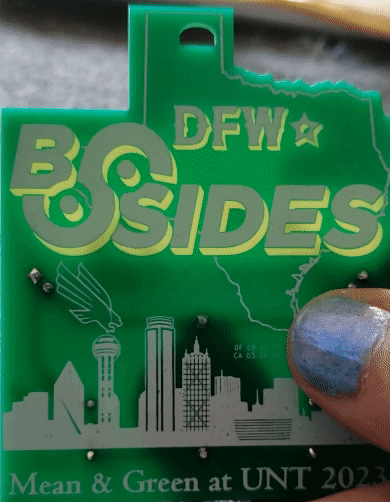
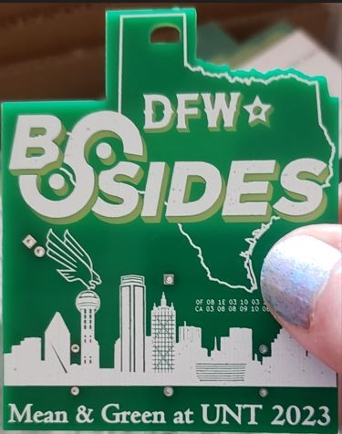
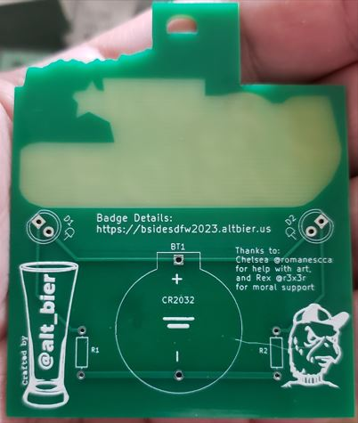
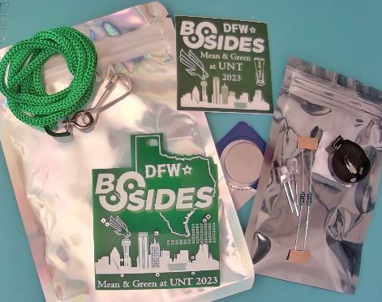
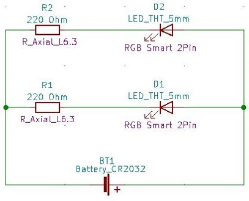
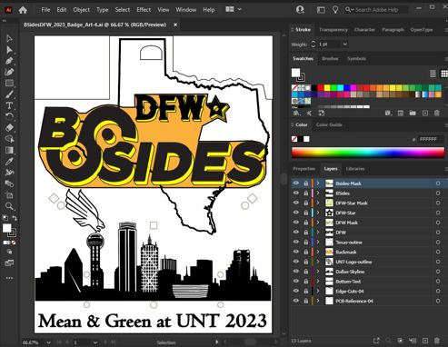
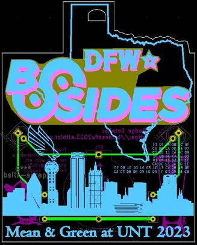
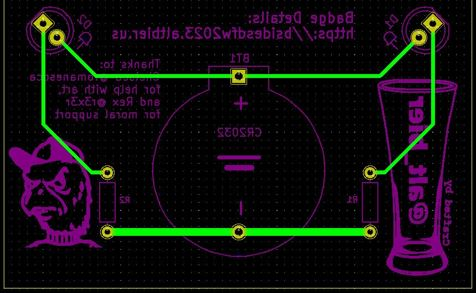

# BSidesDFW 2023 Badge

Welcome to the BSidesDFW 2023 Badge website.

Home to all the information related to the BSidesDFW 2023 UNT Badge.
This includes art and schematics and cad and fab files.  All the things.

I have been supporting the BSidesDFW conference in many way over the past 8 years.

This year my contribution was this badge, volunteering in the HHV, and giving my first ever conference talk.

You can find details about my conference talk here: [Security Automation the Good the Bad and the Ugly](security_automation_gbu.md)

Now lets get into the details of this badge which is a great example of the wearable electronic art that makes up the [#badgelife](https://twitter.com/hashtag/badgelife) community.

I hope you enjoy it.

-- [@alt_bier](https://twitter.com/alt_bier)  - [My Contact Info](https://www.gowen.net/about)

---

# Badge Kit Assembly

This badge kit is an entry level learn to solder kit that only contains five components.

A detailed assembly guide is available here: [Badge Assembly](badge_assembly.md)

# Badge Kit BOM

The badge kit includes the following:

* 4x6in Holographic Bag Including
  * 1x Badge Printed Circuit Board
  * 1x Lanyard
  * 1x Sticker
  * 1x CR2032 Battery
  * 3x4in Anti-Static Bag Including
    * 2x Resistors: 200Ohm 6.3mm Axial 
    * 2x LEDs: 5mm 2pin RGB smart color rotating
    * 1x CR2032 Battery Holder

# Details

With this badge I wanted to highlight the art that is #badgelife as well as providing a learning experience.

You will note the creative use of PCB solder mask voids for back light effects, art that includes the BSidesDFW and UNT logos, a cryptogram challenge puzzle, and just a few easy to solder components in a simple circuit.

In addition to the physical badge kit, this repository contains everything used to create it.

This includes the Adobe Illustrator art files, the KiCad Electronic Design Automation files including circuit schematic and Gerber files that were sent to manufacturing, and the cryptogram challenge puzzle details explaining how to solve it.

This badge can help users learn:

* Basic Soldering Skills
* Basic Electronics
* Simple Cryptography
* Vector Art Applications

## Circuit Schematic

I wanted to keep it simple to help users understand how to light two LEDs in a parallel circuit.

While this circuit will simply keep two LEDs lit it will not flash them or anything else, so to provide some flash for the badge I chose smart LEDs that have red/green/blue flashing built into the body of the LED.

The schematic PDF can be found here: [Badge Schematic](https://github.com/gowenrw/BSidesDFW_2023_Badge/blob/main/eda/BSidesDFW_2023_Badge/snapshots/bsidesdfw_2023_badge-rev1-schematic.pdf)

## Art

For all the art components I used Adobe Illustrator and then exported various layers that were imported into KiCad.

The art files can all be found here: [Badge Art](https://github.com/gowenrw/BSidesDFW_2023_Badge/tree/main/art)

## Electronic Design Automation (EDA)

For the PCB design I used KiCad to lay out the circuit, components, and all the art layers to produce the Gerber files for manufacturing.

The EDA files can all be found here: [Badge EDA](https://github.com/gowenrw/BSidesDFW_2023_Badge/tree/main/eda/BSidesDFW_2023_Badge)

# Crypto Challenge

The badge includes a cryptogram which is a simple puzzle to be solved.

A walkthrough of the puzzle solution is available here: [Crypo Challenge Solution](crypto_challenge_solution.md)
